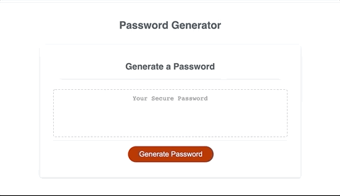

# Password Generator 

## General Information
This application generates a random password based on user-selected criteria. This app runs in a browser and features dynamically updated HTML and CSS powered by JavaScript code. 

## Video Demo

## Technologies
This project was created with: 
* HTML
* CSS
* Javascript

## Launch
This project can be accessed via the following link: https://ds1826.github.io/pswd-generator/

## Acknowledgments
This project is made possible by the awesome support of GW Full-Stack Bootcamp instructors, my BCS Tutor and all who participated in the online study groups. Moreover, the following resources were helpful:

* [Traversy Media via YouTube](https://www.youtube.com/channel/UC29ju8bIPH5as8OGnQzwJyA)
* [freeCodeCamp Javascript Tutorials](https://www.freecodecamp.org)
* [stackoverflow](https://stackoverflow.com)
* [MDN Web Docs: Javscript](https://developer.mozilla.org/en-US/docs/Web/JavaScript)

## Contact
Created by @DS1826
